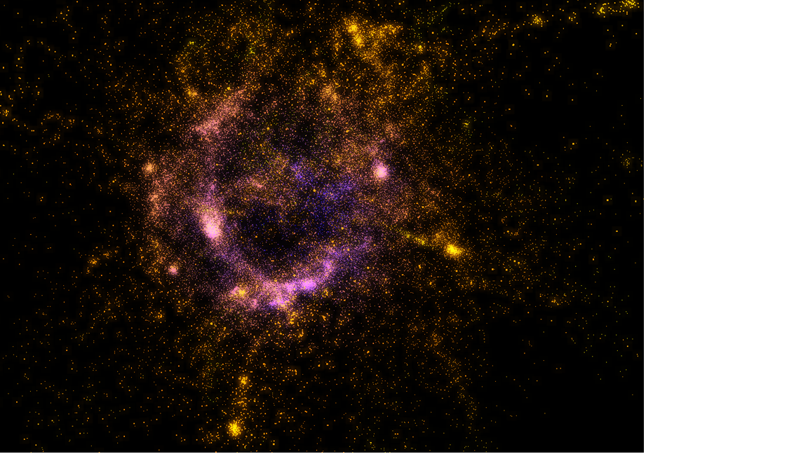
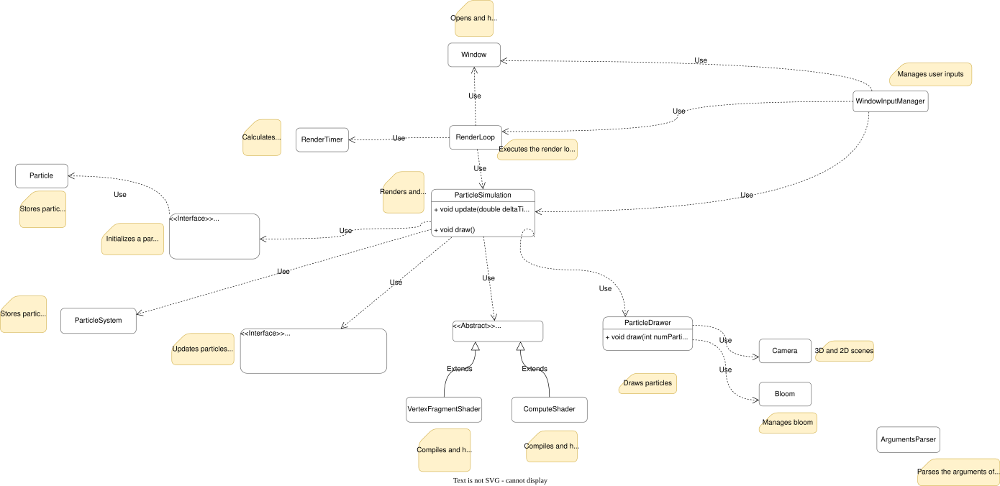

# Gravitas

A 3D N-body gravitational simulation built to explore CPU and GPU parallel programming. Particles interact through Newtonian gravity using algorithms ranging from brute-force O(n²) to Barnes-Hut O(n log n), with an OpenGL renderer that includes bloom post-processing.



## How it works

Each frame, the active solver computes a gravitational force on every particle, then integrates positions and velocities forward one time step using leapfrog integration.

**Brute-force solvers (v1–v4):** Every particle interacts with every other — O(n²). Versions 1 and 2 run on the CPU (sequential and OpenMP-parallel). Versions 3 and 4 dispatch OpenGL compute shaders; v4 uses a shared-memory tiling trick from [NVIDIA GPU Gems 3 Ch. 31](https://developer.nvidia.com/gpugems/gpugems3/part-v-physics-simulation/chapter-31-fast-n-body-simulation-cuda) to reduce global memory bandwidth.

**Barnes-Hut solvers (v5–v7):** An octree is rebuilt every frame. Particles far enough from a node are approximated by that node's aggregate mass and center of mass, cutting complexity to O(n log n). The opening criterion is s/d < θ (θ = 0.5). The tree traversal is stackless — each node carries a precomputed `next` pointer so force calculation is a simple linked-list walk. See `BarnesHutExplained.md` for a full breakdown of the GPU tree construction.

Plummer softening (ε²) is applied to all force calculations to prevent singularities when particles get very close.

## Requirements

- `cmake` ≥ 3.16
- C++17 compiler (Clang on macOS, GCC or MSVC on Linux/Windows)
- OpenGL 4.3+
- `xorg-dev` (Linux only)
- OpenMP (optional but recommended for v2, v6)

Dependencies (glfw, glad, glm) are fetched automatically by CMake on first build.

## Build and run

```bash
mkdir build && cd build
cmake ..
make -j$(nproc)   # Linux
make -j$(sysctl -n hw.logicalcpu)   # macOS
./N-body
```

On Windows, replace the last two steps with:
```bash
cmake --build . --config Release
.\Release\N-body.exe
```

Default run (100 particles, galaxy disk, CPU sequential):
```bash
./N-body -v 1 -n 100 -i 2 -t 0.001 -s 0.0935
```

## Arguments

| Flag | Description |
|------|-------------|
| `-v` | Solver version (1–7) |
| `-n` | Number of particles |
| `-i` | Initialization type (1–6) |
| `-t` | Time step |
| `-s` | Squared Plummer softening |
| `-f` | Path to a particle system file |

**Versions**

| `-v` | Description | Complexity |
|------|-------------|------------|
| 1 | CPU sequential brute-force | O(n²) |
| 2 | CPU parallel brute-force (OpenMP) | O(n²) |
| 3 | GPU brute-force (compute shader) | O(n²) |
| 4 | GPU tiled brute-force (shared memory) | O(n²) |
| 5 | Barnes-Hut CPU sequential | O(n log n) |
| 6 | Barnes-Hut CPU parallel (OpenMP) | O(n log n) |
| 7 | Barnes-Hut GPU (fully parallel) | O(n log n) |

> v5–v7 can become unstable with very large particle counts or near-collisions. For stable simulations use v1–v4.

**Initializations**

| `-i` | Shape |
|------|-------|
| 1 | Cube (volume) |
| 2 | Galaxy disk |
| 3 | Lagrange triangle (3 bodies) |
| 4 | Sphere surface |
| 5 | Ball (solid sphere) |
| 6 | Cube surface |

## Controls

| Input | Action |
|-------|--------|
| Esc | Close |
| Space | Pause / resume |
| Scroll | Zoom |
| Click + drag | Rotate camera |
| B | Toggle bloom |
| I / D | Increase / decrease bloom intensity |
| Q | Toggle point size |

## Program structure



New solver: implement `ParticleSolver`, wire it into `main.cpp` and `enums.h`.  
New initialization: implement `ParticleSystemInitializer`, wire it into `main.cpp` and `enums.h`.

## Particle system file format

```
Particle System with 3 particles:
Particle ID: 0
Position: (5.8337, 4.6008, 3.35599)
Velocity: (-1.15428, 1.8317, 0)
Acceleration: (0, 0, 0)
Mass: 0.625
...
```

World dimensions are (5, 5, 5). Pass the file path with `-f path/to/file`.
